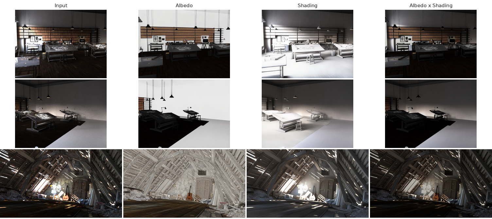

# Albedo Estimation via Latent Bridge Matching

**Carme Corbi, [David Serrano-Lozano](https://davidserra9.github.com), [Javier Vazquez-Corral](https://jvazquezcorral.github.io/), [Maria Vanrell](http://www.cat.uab.cat/~maria/)**

Universitat Autònoma de Barcelona and Computer Vision Center

*Paper accepted at the Color and Imaging Conference (CIC 2026)*

This work was part of Carme's Master's Thesis for the [Master's in Computer Vision](https://mcv.uab.cat/) at the UAB. The arXiv paper contains extended experiments from this thesis.

[]([https://github.com/CVC-Color/albedoLBM](https://arxiv.org/abs/2609.09884))
[](https://huggingface.co/davidserra9/albedo-lbm)
[](LICENSE)



## Overview

Intrinsic Image Decomposition (IID) splits an image `I` into an albedo `A` and a
shading `S`, so that `I = A · S`. Generative approaches to IID are accurate but
expensive, and their predictions are hard to tie back to the image formation
model because sampling starts from Gaussian noise.

We build albedo estimation on **Latent Bridge Matching** (LBM), which transports
the *source image itself* to the target instead of starting from noise. Because
the trajectory is anchored to the observed pixels, the predicted latent can be
decoded and supervised in pixel space with a **reconstruction loss** that enforces
`I ≈ A · S`. Inference takes a single bridge step.

The released pipeline is the best model of the paper: an albedo model conditioned
on shading (**LBM-AID**), paired with a shading model conditioned on albedo
(**LBM-SID**). Albedo and shading are mutually informative, and this pairing gives
the lowest reconstruction error we measured (MIT 0.0104, ARAP 0.0139,
Hypersim 0.0250).

## Installation

Python 3.10 or later and a CUDA GPU are recommended. In bfloat16, the two models
together peak at ~10.5 GB of VRAM on a 768x576 image (~5.8 GB when you supply your
own shading and only the albedo model is loaded).

```bash
git clone https://github.com/CVC-Color/albedoLBM.git
cd albedoLBM

conda create -n albedo-lbm python=3.10 -y
conda activate albedo-lbm

pip install -e .
```

<details>
<summary>With <code>venv</code> instead of conda</summary>

```bash
python3.10 -m venv .venv && source .venv/bin/activate
pip install -e .
```
</details>

## Model weights

The weights live on the Hugging Face Hub at
[`davidserra9/albedo-lbm`](https://huggingface.co/davidserra9/albedo-lbm) and are
downloaded automatically the first time you run the pipeline.

| Sub-folder | Model | Task | Conditioning | Size |
| --- | --- | --- | --- | --- |
| `albedo/` | LBM-AID | RGB → albedo | shading | 5.0 GB |
| `shading/` | LBM-SID | RGB → shading | albedo | 5.0 GB |

Both are Stable Diffusion XL UNets (~2.5B parameters) with a frozen SDXL VAE,
stored in bfloat16. The SDXL VAE and scheduler are pulled from
`stabilityai/stable-diffusion-xl-base-1.0` on first use.

To keep the files elsewhere, pass `--model_dir` a local directory (see
[Local weights](#local-weights)).

## Inference

### Command line

```bash
# One image or a whole folder; weights are fetched from the Hub
python scripts/infer.py --input assets/examples --output results

# Also write the estimated shading and the A · S reconstruction
python scripts/infer.py --input image.png --output results \
    --save_shading --save_reconstruction
```

| Argument | Description | Default |
| --- | --- | --- |
| `--input` | Input image, or a directory of images. | *required* |
| `--output` | Directory for the predictions. | `results` |
| `--model_dir` | Hub repository id, or a local directory with `albedo/` and `shading/`. | `davidserra9/albedo-lbm` |
| `--shading` | Condition on this shading image instead of estimating one. Skips loading the shading model. | `None` |
| `--num_steps` | Bridge steps per model. | `1` |
| `--device` | Device to run on. | `cuda` |
| `--dtype` | `bfloat16`, `float16` or `float32`. | `bfloat16` |
| `--save_shading` | Also save the estimated shading. | off |
| `--save_reconstruction` | Also save `albedo · shading`. | off |

Images are processed at their original resolution; no cropping or resizing is
applied. Quality degrades beyond roughly 2K, since training used 256×256 crops.

### Python

```python
from PIL import Image
from albedo_lbm import IntrinsicDecomposer

pipeline = IntrinsicDecomposer.from_pretrained()      # downloads both models
result = pipeline(Image.open("image.png"))

result.albedo.save("albedo.png")
result.shading.save("shading.png")
result.reconstruction().save("reconstruction.png")    # albedo * shading
```

If you already have a shading estimate, you can skip the shading model entirely:

```python
pipeline = IntrinsicDecomposer.from_pretrained(load_shading_model=False)
result = pipeline(image, shading=Image.open("shading.png"))
```

For a guided walkthrough with side-by-side figures, see
[`notebooks/demo.ipynb`](notebooks/demo.ipynb).

### How the two stages fit together

The albedo model needs a shading estimate and the shading model needs an albedo
estimate. `IntrinsicDecomposer` resolves the circularity with a bootstrap pass:

```
1. bootstrap   albedo_0 = LBM-AID(image, conditioning = image)
2. shading     shading  = LBM-SID(image, conditioning = albedo_0)
3. albedo      albedo   = LBM-AID(image, conditioning = shading)
```

Each stage is a single bridge step, so the whole decomposition is three UNet
evaluations — about 1.1 s for a 768×576 image on an RTX 3090.

Passing `--shading` (or `shading=` in Python) skips steps 1 and 2 entirely.

### Local weights

```bash
huggingface-cli download davidserra9/albedo-lbm --local-dir weights
python scripts/infer.py --input image.png --output results --model_dir weights
```

A local `--model_dir` must contain one sub-directory per model, each with a
`config.yaml` and a `model.safetensors`:

```text
weights/
├── albedo/
│   ├── config.yaml
│   └── model.safetensors
└── shading/
    ├── config.yaml
    └── model.safetensors
```

## Repository layout

```text
configs/           model configs (architecture + bridge parameters)
scripts/
├── infer.py                    command-line inference
├── convert_lightning_ckpt.py   training .ckpt -> inference safetensors
└── upload_to_hub.py            push the converted weights to the Hub
notebooks/demo.ipynb            walkthrough with figures
src/albedo_lbm/
├── pipeline.py                 the two-stage IntrinsicDecomposer
├── inference/                  model loading and single-pass inference
└── models/                     LBM model, UNet wrapper, VAE, conditioners
```

Training code is not part of this release. `scripts/convert_lightning_ckpt.py` is
provided to turn our Lightning training checkpoints (~15 GB, including optimizer
state) into the 5 GB inference weights distributed on the Hub.

## Citation

```bibtex
@inproceedings{corbi2026albedo,
  title     = {Albedo Estimation via Latent Bridge Matching},
  author    = {Corbi, Carme and Serrano-Lozano, David and Vazquez-Corral, Javier and Vanrell, Maria},
  booktitle = {Color and Imaging Conference (CIC)},
  year      = {2026}
}
```

## Acknowledgements

This code builds on [LBM: Latent Bridge Matching](https://github.com/gojasper/LBM)
by Jasper Research, and on the Stable Diffusion XL VAE and UNet by Stability AI.
The models were trained on [InteriorVerse](https://interiorverse.github.io/) and
[Hypersim](https://github.com/apple/ml-hypersim); the example images in
`assets/examples` come from Hypersim and ARAP.

## License

Released under [CC BY-NC 4.0](LICENSE), following the license of the upstream LBM
code this repository derives from. The weights are subject to the same terms, and
additionally to the terms of the datasets and of the SDXL backbone.
